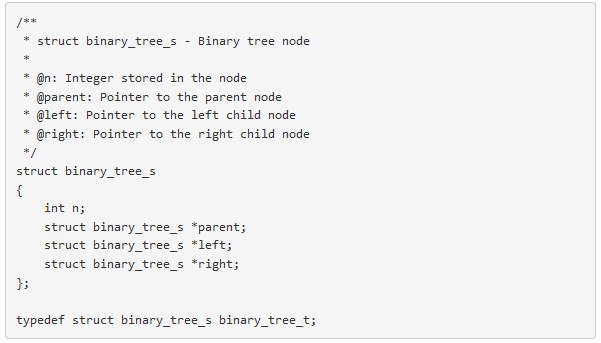

# 0x14. Heap Extract

# More Info

## Data structures

Please use the following data structures and types for binary trees. Don’t forget to include them in your header file.

### Basic Binary Tree

### Max Binary Heap

## Print function

To match the examples in the tasks, you are given [this function](https://github.com/holbertonschool/0x1C.c)

This function is used only for visualization purposes. You don’t have to push it to your repo. It may not be used during the correction.

# Task

Write a function that extracts the root node of a Max Binary Heap:

##### <li>Prototype: `int heap_extract(heap_t **root);`</li>
##### <li>root is a double pointer to the root node of the heap</li>
##### <li>Your function must return the value stored in the root node</li>
##### <li>The root node must be freed and replace with the last `level-order` node of the heap</li>
##### <li>Once replaced, the heap must be rebuilt if necessary</li>
##### <li>If your function fails, return `0`</li>

Note: In order for the main file to compile, you are provided with [this static library](https://s3.amazonaws.com/intranet-projects-files/holbertonschool-low_level_programming/466/libheap.a). This library won’t be used during correction, its only purpose is for testing.